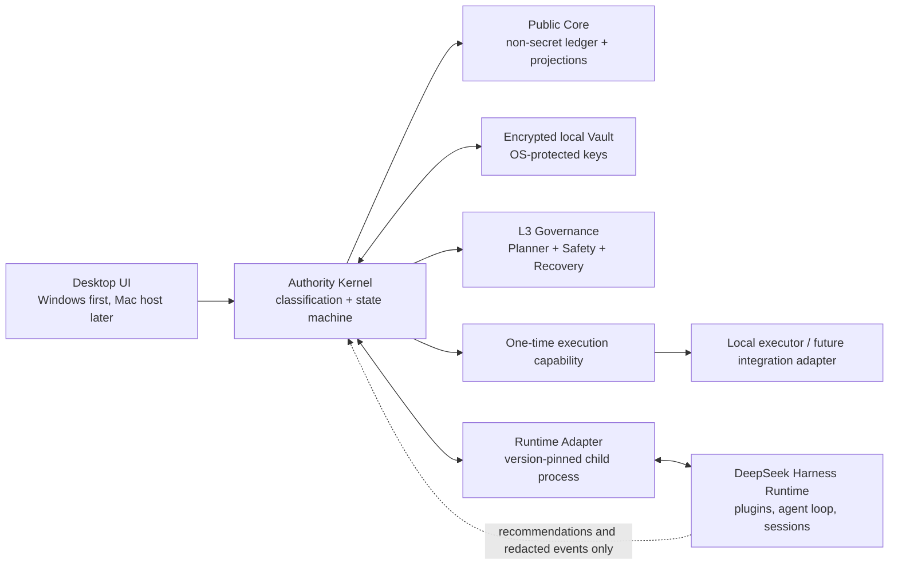

# JARVIS P0 Architecture Baseline (Draft)

**Status:** Approved P0 architecture baseline
**Scope:** Architecture baseline and the first testable vertical slice only. This document creates no business implementation, external account, or production credential path.

## 1. Decision summary

JARVIS P0 is a local-first desktop application. Windows is the initial host; all product-domain interfaces must remain portable to a future macOS host. DeepSeek Harness is a separately launched, replaceable local Runtime used for agent execution and session streaming. It is not the product authority, vault, policy engine, or permanent data model.

The product has two deliberate data planes:

| Plane | Contains | Must not contain |
|---|---|---|
| Public Core | action intents, risk classifications, non-secret policy versions, signed/hashed decision evidence, redacted session references, projections, and rollback plans | plaintext credentials, vault payloads, raw private files, or sovereign-key material |
| Local encrypted Vault | credentials, user-private artifacts, authorization grants, recovery material, and encrypted audit attachments | public API assumptions or direct model-readable secret values |

The authority rule is non-negotiable: no agent, Runtime, UI, or plugin can convert a recommendation into an L3 side effect. The product Authority Kernel is the only component that can issue a one-time, capability-scoped execution grant after all required checks succeed.

## 2. Why the Runtime boundary is out of process

Three integration choices were assessed:

| Choice | Result | Reason |
|---|---|---|
| Import Harness packages into the application process | Rejected for P0 | Couples product release cadence, persistence vocabulary, and plugin composition to a developer-preview Runtime that explicitly permits breaking changes. |
| Launch Harness as a local child process behind a product-owned adapter | **Selected** | The Runtime already provides stdio JSON-RPC SDK driving, durable session events, and an explicit executable/config launch specification. Product ownership remains outside the Runtime. |
| Reimplement model loop and tool runtime in JARVIS | Deferred | Gives maximum control but discards the usable Harness capability before the product policy has been proven. |

The selected adapter owns process lifecycle, a pinned Harness distribution/configuration, event translation, protocol compatibility checks, and shutdown. It accepts only a product `RuntimeRequest` and returns a redacted `RuntimeEvent` stream. It must never expose the Harness session log as the Core audit record or treat a Harness approval as product authorization.

Harness evidence informing this choice:

- Its architecture treats every capability as a configurable plugin, including the agent loop, tools, session log, and approvals.
- Its SDK is designed to drive a Runtime from another process via newline-delimited JSON-RPC.
- The SDK currently has no protocol-version negotiation and no per-prompt cancellation. Product code must therefore pin a supported Runtime release, enforce a startup compatibility allow-list, and terminate/restart the sidecar only through the adapter.
- Harness session persistence is append-only but pre-release (`SESSION_FORMAT_VERSION` 0) and not encrypted; it may support runtime recovery but cannot be the product’s durable authority or vault.
- Harness approval is one-shot and fail-closed, which is useful as a Runtime-local safety control but insufficient for JARVIS’s persistent, multi-agent L3 governance.

## 3. P0 topology and ownership

### 3.1 Desktop host portability

The application uses a host abstraction with these narrow product-owned ports:

- `SecureKeyStore`: creates/unlocks non-exportable device keys and holds the user-presence binding. Windows maps to DPAPI/Credential Manager or a product-selected platform service; macOS maps to Keychain/Secure Enclave where available.
- `LocalPathPolicy`: normalizes paths, resolves user-approved roots, and rejects traversal or platform-specific path assumptions before an action is classified.
- `ProcessSupervisor`: starts, probes, and terminates the Harness sidecar without leaking ambient secrets to its environment.
- `DesktopInteraction`: presents decision evidence, user approvals, and an explicit sovereign-key ceremony.

All Core interfaces use logical resource IDs and capability descriptors, never registry paths, Windows ACL names, drive letters, or a direct dependency on a platform keychain API.

### 3.2 Core and Vault separation

`Public Core` is independently readable and exportable because it contains only redacted, non-secret evidence. Each record references an encrypted Vault object by opaque ID and integrity digest; no Core field can recover a vault plaintext. `Vault` encryption uses authenticated encryption with a versioned envelope, per-record data-encryption keys, and a locally protected root/key-encryption key. The sovereign key unlocks or authorizes a narrowly scoped Vault operation; it is not copied into prompt text, Runtime configuration, logs, telemetry, or an agent tool result.

The first implementation may use a local database or files for either plane, but storage technology is not the boundary. The mandatory boundary is: Core can be backed up or inspected without revealing a Vault value, and a Runtime process cannot read the Vault directory or request a generic decrypt operation.

## 4. Action levels and governing state machine

P0 uses a deterministic classifier over declared action intent, target, data class, capability, reversibility, and external-effect flag. Agent text can propose an intent; it cannot set its final level.

| Level | Meaning | P0 authorization |
|---|---|---|
| L0 | Observation or explanation with no write, credential, or external effect | Restricted read capability; record intent/result. |
| L1 | Bounded, reversible local preparation | Show scope and simulated impact; require the policy’s user confirmation before a one-time local capability. |
| L2 | Local mutation with meaningful impact or sensitive-but-non-secret data handling | Explicit user approval plus a bounded one-time capability, preflight, and executable rollback recipe. |
| L3 | External effect, credential use, irreversible/high-impact mutation, or any action the classifier cannot safely bound | Three-agent unanimous recommendation **and** a sovereign-key authorization, both bound to the exact action digest. |

The P0 L3 agents have independent roles and separately persisted evidence:

1. **Planner** verifies the requested scope, target set, and executable preflight.
2. **Safety** verifies classification, data exposure, capability limits, and policy compliance.
3. **Recovery** verifies reversibility, rollback prerequisites, and the least-harm alternative.

Each produces `approve` or `reject` with a structured reason and evidence references. All three `approve` votes must bind to the same canonical `ActionIntent` digest and policy version. Any missing, malformed, stale, or reject vote is a rejection. Voting model output is advisory evidence; the Authority Kernel performs the unanimity predicate deterministically.

State transitions are:

`Draft → Classified → PreflightReady → (L0/L1/L2 authorized path | L3Voting) → L3Unanimous → AwaitingSovereignKey → AuthorizedOnce → Executing → Completed | RolledBack | Failed`.

An L3 non-unanimous decision transitions to `RefusedPendingSovereignty`, never to execution. It must persist and display all of the following before waiting for the user’s sovereign-key action:

- a no-side-effect preflight/simulation with the exact proposed target scope;
- a rollback plan with prerequisites and the point at which rollback stops being reliable;
- at least one lower-risk alternative, including a draft-only or user-executed alternative when no safe automated action exists;
- the rejecting votes and the policy/risk reasons, redacted for Core visibility.

The sovereign-key ceremony is an explicit local user-presence action. It issues a short-lived, single-action authorization bound to `ActionIntent` digest, policy version, device/user context, expiry, and requested capability. It cannot turn a rejected vote into approval; it can only satisfy the final required factor after unanimous L3 approval. This distinction prevents “wait for key” from becoming an agent-operated bypass.

## 5. First testable vertical slice: L3 refusal and recovery packet

The first slice deliberately performs no real mutation or external call. A user submits a synthetic L3 `ActionIntent` representing a credential-bearing external operation. The Authority Kernel classifies it as L3, sends a redacted intent to the three governance roles through a fake Runtime Adapter, receives at least one deterministic rejection, and emits a `RefusalPacket` to the UI/Core.

### Module boundaries

| Module | Owns | Depends on |
|---|---|---|
| `action-intent` | Canonical intent schema, digest, risk attributes, no-side-effect preflight input | Pure validation and hashing only |
| `authority-kernel` | Level classification, state transitions, vote validity, capability issuance/refusal | `action-intent`, policy registry, ledger, vault-gateway interface |
| `governance-orchestrator` | Sends role-specific redacted briefs and collects Planner/Safety/Recovery recommendations | Runtime Adapter interface; no executor or vault access |
| `refusal-packet` | Simulation, rollback recipe, alternative plans, and key-wait presentation model | Intent, valid governance evidence, policy registry |
| `public-ledger` | Append-only, non-secret decision records and projection queries | Local storage interface, redactor |
| `vault-gateway` | Opaque vault references and sovereign-key authorization verification | `SecureKeyStore`; unavailable in the refusal happy path |
| `runtime-adapter` | Pinned Harness process protocol, event translation, redaction, health/compatibility status | `ProcessSupervisor`; Harness only |
| `desktop-decision-ui` | Read-only evidence display and explicit future user action | Authority queries/commands; no direct Runtime calls |

The slice uses an in-memory ledger, deterministic classifier, and fake Runtime Adapter. A later slice may replace those adapters without changing authority semantics. The real Harness adapter is integration-tested separately and remains unable to authorize execution.

### Dependencies and risks

| Dependency/risk | Effect | P0 control |
|---|---|---|
| Harness developer-preview API/protocol drift | Sidecar may fail or emit unrecognized events | Pin a tested distribution; startup compatibility allow-list; fail closed to “Runtime unavailable.” |
| Harness SDK lacks cancellation/version negotiation | A hung request is difficult to attribute/cancel safely | Product time budget; close/reap only through `ProcessSupervisor`; do not issue a capability before Runtime work is settled. |
| Model disagreement or hallucinated vote evidence | Could fabricate an apparent L3 approval | Canonical action digest, schema validation, independent role outputs, deterministic all-approve check, and full ledger record. |
| Core/Vault boundary erosion | Sensitive values leak into logs or prompts | Typed redacted briefs, opaque references, allow-listed event fields, and negative tests for known secret sentinels. |
| Windows-first assumptions block macOS | Host services become platform-specific | Four host ports above; platform conformance tests run against fakes before native adapters exist. |
| Unclear definition of sovereign key | Authorization ceremony could become cosmetic | Do not ship execution until the key type, user-presence proof, recovery/revocation behavior, and threat model are approved. |

## 6. Acceptance criteria for the vertical slice

1. Given an external or credential-bearing synthetic intent, `authority-kernel` deterministically records L3; changing model text cannot downgrade it.
2. The three role briefs contain the same intent digest and contain neither a plaintext secret nor a Vault decrypt request.
3. Any `reject`, missing vote, mismatched digest, stale policy version, malformed result, or Runtime failure results in `RefusedPendingSovereignty` and no execution capability.
4. A refusal produces a persisted, redacted `RefusalPacket` containing preflight, rollback limits, alternative, vote evidence, and the explicit waiting state.
5. No network client, process executor, external account adapter, or Vault plaintext path is instantiated in the slice; this is verified by test doubles that fail the test if invoked.
6. A forged sovereign-key authorization cannot change a rejection to approval; a valid key is also insufficient without three valid approvals.
7. All Core records remain exportable after replacing every Vault value with an opaque reference; a sentinel secret is absent from serialized Core and Runtime brief snapshots.
8. The same application-core test suite passes with fake Windows and fake macOS `SecureKeyStore`, `LocalPathPolicy`, `ProcessSupervisor`, and `DesktopInteraction` ports.

## 7. Delivery sequence after review

1. Freeze the canonical `ActionIntent`, `Vote`, `DecisionRecord`, `RefusalPacket`, and `SovereignAuthorization` schemas plus their redaction rules.
2. Implement and test the deterministic L3 refusal slice entirely with fakes.
3. Implement the Windows host adapters and encrypted Vault threat model, then add one-time L3 authorization tests without an external executor.
4. Add the pinned Harness Runtime Adapter contract test using a local fake JSON-RPC peer before any real Runtime process.
5. Only then evaluate a real local Harness session and a separately approved, capability-limited executor.

## 8. Open decisions requiring product-owner direction

1. What exact action classes map to L1 versus L2 (for example, local file edits, OS settings changes, and private-file reads)? This baseline intentionally makes ambiguous cases L3.
2. What is the sovereign-key form: passkey/device-bound signing key, hardware token, recovery phrase, or a combination? What is the recovery and revocation process?
3. Which audited Core records are user-exportable, how long are they retained, and may any redacted Runtime transcript be retained at all?
4. Is the Windows P0 desktop host technology constrained (for example, Tauri, Electron, native .NET), or should host selection follow a later portability/security spike?
5. Is a real model provider in scope for the first runnable slice, or must all P0 governance tests remain deterministic until the authority model is approved?

## 9. Read-only inspection record

Inspected without modification: the product worktree (initial empty control-plane commit `3078270`); `E:\soft\deepseek-harness` root README, `AGENTS.md`, workspace manifest, architecture document, and the core/session, interaction, credentials, settings, preset, SDK, session-persistence, and Codex-hook package documentation. Harness source snapshot at inspection time: `6c5236e`.
